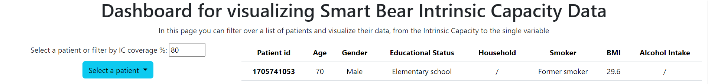
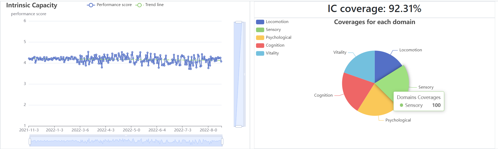
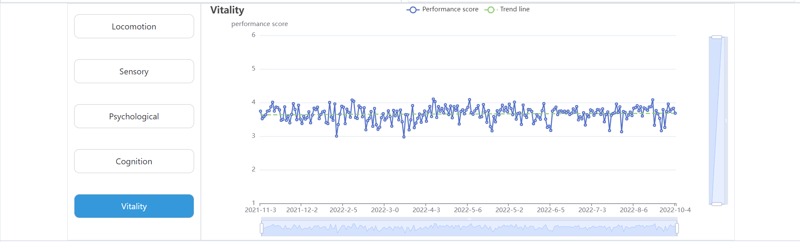
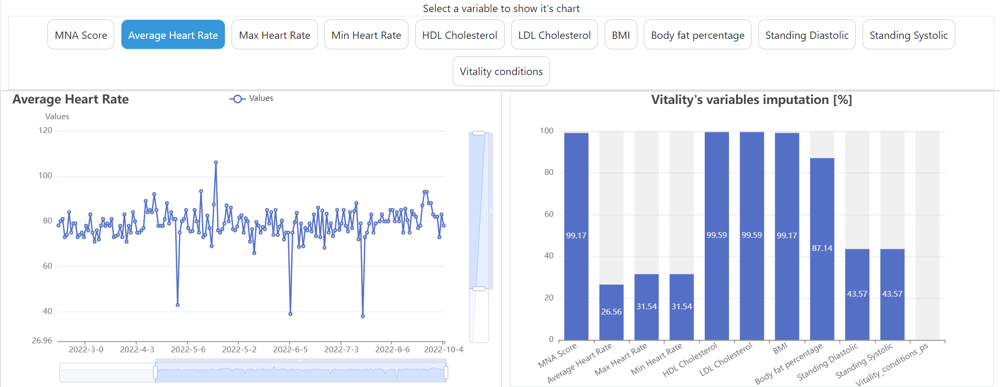
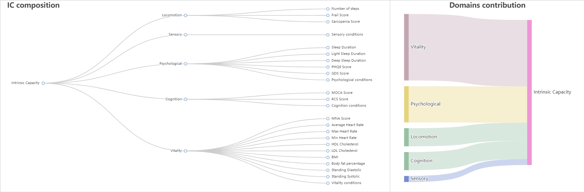

# Intrinsic Capacity dashboard for Smart Bear project
This dashboard is the final part of my thesis project, useful for visualizing data regarding Intrinsic Capacity using data from the Smart Bear project, using [Node.js](https://nodejs.org/en), [Bootstrap](https://getbootstrap.com/) and [Apache ECharts](https://echarts.apache.org/en/index.html). The data was processed using [Apache Spark](https://spark.apache.org/) and [PySpark](https://spark.apache.org/docs/latest/api/python/index.html).

Davide Carniselli -- 2022/2023

## Sample images

# Acknowledgements
- Prof. Paolo Ceravolo
- Dr Samira Maghool
- [Smart Bear](https://www.smart-bear.eu/)
- [University of Milan Statale](https://www.unimi.it/it)
